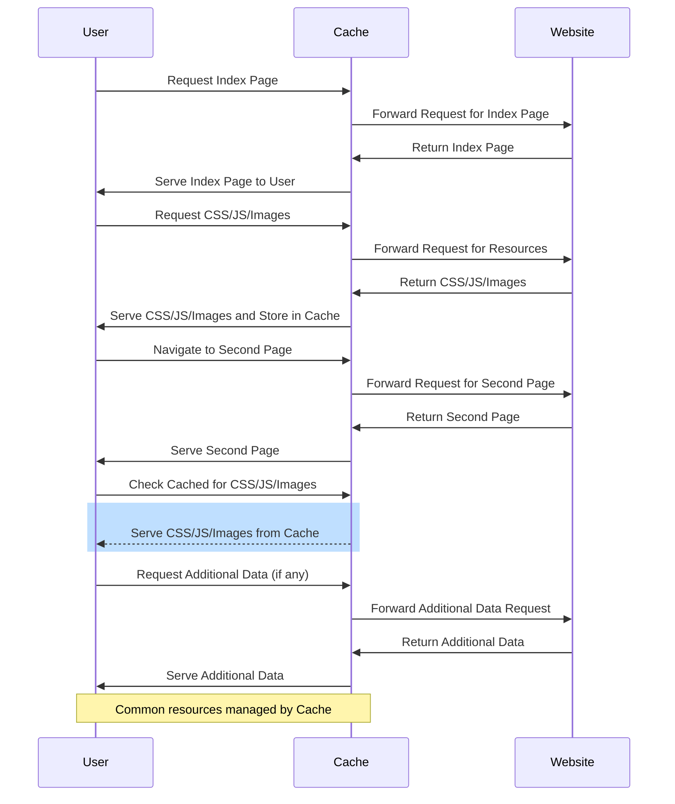
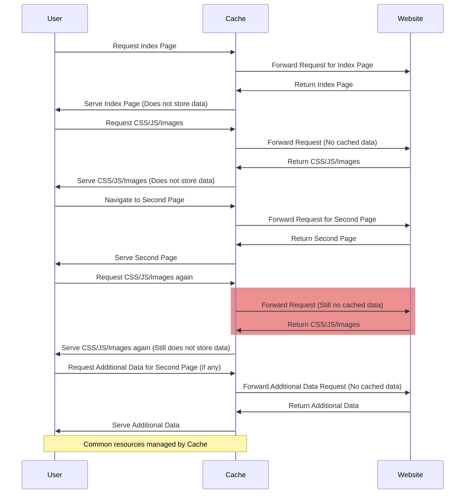
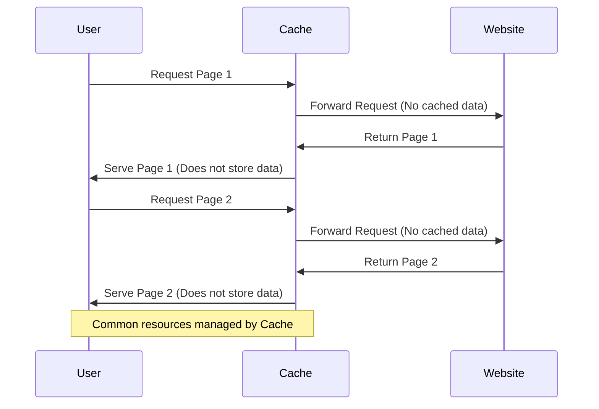
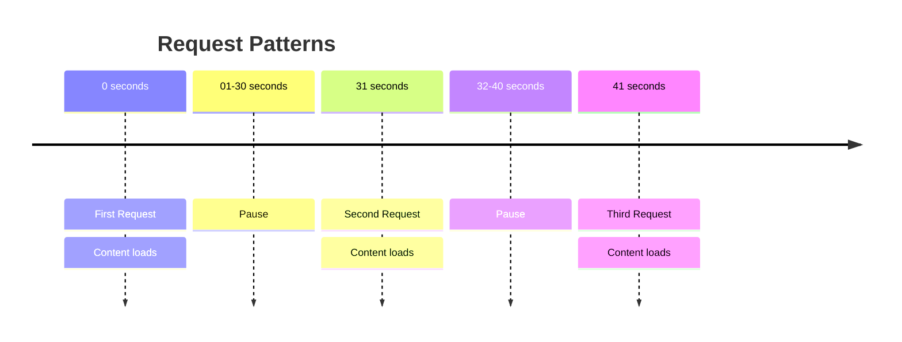
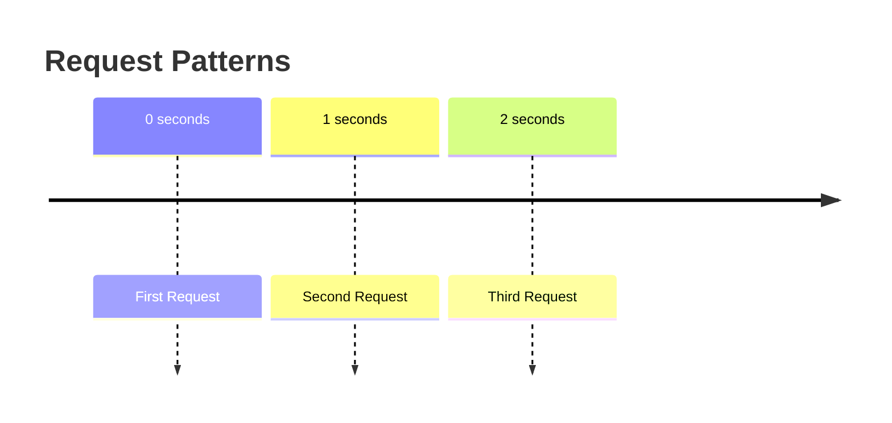

Frontmatter: True
Refresh: 3600
Title: SEOktoberfest 2025
Author: Robert "RSnake" Hansen
Bgcolor: #FFFFFF
Bgimage: 2025_SEOktoberfest/bgimage.jpg
---

# Scraping in the age of AI

## By Robert Hansen


---

# Normal Browser



---

# Headless



---

# Wget


---


---

# Valid Timing



---

# Invalid Timing



---

# Not just request timing

Also bounce timing! How fast does this user leave the page? Dwell times are realistically slow.

If the IP in question is leaving the page extremely fast or suddenly a lot of IPs are, you are being scraped or DoS'd.


---

# Patterns

## Normal users are organic

```text
landing_page.html
about_us.html
pricing.html
checkout.html
...```

## Scrapers are not

```text
page.php?id=1
page.php?id=2
page.php?id=3
...```

---

# HTTP Headers in a Browser

| Header | Value |
| :-: | :-: |
| Priority | u=0, i |
| Accept-Encoding | gzip, deflate, br, zstd |
| Referer | https://search.brave.com/ |
| Sec-Fetch-Dest | document |
| Sec-Fetch-User | ?1 |
| Sec-Fetch-Mode | navigate |
| Sec-Fetch-Site | cross-site |
| Accept-Language | en-US,en;q=0.9 |
| Sec-Gpc | 1 |
| Accept | text/html,application/xhtml+xml,application/xml;q=0.9,image/avif,image/webp,image/apng,*/*;q=0.8 |
| User-Agent | Mozilla/5.0 (Macintosh; Intel Mac OS X 10_15_7) AppleWebKit/537.36 (KHTML, like Gecko) Chrome/136.0.0.0 Safari/537.36 |
| Upgrade-Insecure-Requests | 1 |
| Sec-Ch-Ua-Platform | "macOS" |
| Sec-Ch-Ua-Mobile | ?0 |
| Sec-Ch-Ua | "Chromium";v="136", "Brave";v="136", "Not.A/Brand";v="99" |
| Host | manytools.org |
| Content-Length |  |
| Content-Type |  |


---

# Compared to wget

| Header | Value |
| :-: | :-: |
| Accept-Encoding | identity |
| Accept | */* |
| User-Agent | Wget/1.25.0 |
| Connection | close |
| X-Accel-Internal | /internal-nginx-static-location |
| X-Real-Ip | 72.182.37.167 |
| Host | manytools.org |
| Authorization | |
| Mod-Rewrite | On |

---

# Origin IPs

## Large cloud providers:
- Cloudflare: [https://www.cloudflare.com/ips/](https://www.cloudflare.com/ips/)
- Azure: [https://www.microsoft.com/en-us/download/details.aspx?id=56519](https://www.microsoft.com/en-us/download/details.aspx?id=56519)
- EC2: [https://ip-ranges.amazonaws.com/ip-ranges.json](https://ip-ranges.amazonaws.com/ip-ranges.json)
- GCP: [https://www.gstatic.com/ipranges/cloud.json](https://www.gstatic.com/ipranges/cloud.json)

## Other shortcuts:
- Greynoise 
- ASN info
- IP reputation like pihole

## They aren't going to be valid, like these:
- Bingbot: [https://www.bing.com/toolbox/bingbot.json](https://www.bing.com/toolbox/bingbot.json)
- Googlebot: [https://developers.google.com/search/apis/ipranges/googlebot.json](https://developers.google.com/search/apis/ipranges/googlebot.json])
- OpenAI: [https://openai.com/chatgpt-actions.json](https://openai.com/chatgpt-actions.json)

---

# Robots.txt trap

If they hit *robots.txt*... guess what? They're a robot in 99.9999% of the cases. Or SEOs. Either way, I want to know.

Oh yeah, and this might be a useful way of identifying Google tests, btw. :)

And if they __didn't__ hit *robots.txt* and they claim in their User-Agent to be *Googlebot*, I'd definitely want to know.


---

# Cutting and Pasting Correlation

```plain
123.123.123.123 - - [23/Mar/2025:18:23:30 -0500] "GET /some-obscure-page HTTP/1.1" …
222.222.222.222 - - [23/Mar/2025:18:23:46 -0500] "GET /some-obscure-page HTTP/1.1" …```

## Most likely cause is someone cutting and pasting or suddenly switching to a proxy

---

# Beware of Liars and Thieves

## Pop quiz, hot shot. What do you think of this referring url:

```http
Referrer: http://Google.com```

---

# Beware of Liars and Thieves

## Pop quiz, hot shot. What do you think of this referring url:

```http
Referrer: http://Google.com```

- Referrer is spelled correctly! It shouldn't be.
- HTTP? Google doesn't use that anymore. It's a HTTPS only world these days.
- Camel case hostname "*Google*" instead of "*google*"
- Missing "*www.*" subdomain which is an easier mistake to make these days due to how browsers hide it in the URL bar
- Missing a URL path *https://www.google.com/* (it's a lie, but it's what the browser sends cross-domain)

---

# Consider Probing Them!

- Are they running port 80/443?
- How about port 22?

## Why is a home user running those things?

Is the 80/443 a home firewall that is misconfigured, or a website, or worse yet a proxy?

---

# Cloaking

Hidden links will get followed by poorly written crawlers. You can cause massive ingestion problems, feeding bad data.

All the old crappy cloaking tricks you know and love... time to wheel them back out... :)

- White on white
- Off-viewable page
- JS injected (especially if you want to enforce JS) - oh yeah, and you can get them to mine some crypto for you
- ShadowDOM
- Etc...

---

# Raw logs, raw data

For almost all of this you need raw logs. 

Attackers won't hit GA in many cases.

Sometimes on purpose but often just because they're lazy.

**Bonus points** for forensically secured logs that get all of the HTTP headers, and not just the default.

---

# When all else fails use DRM

The ha.ckers.org scraper story


And the eBay DRM story

---

# Oh, yeah, and if you want a commercial option...

* Arkose Labs
* Cloudflare Bot Detection
* DataDome Bot Protection (AWS)
* ReCaptcha
* Shape Security

(In that order)

---

## And now for something completely different

If you want to know more about how I made this preso itself, let me know. It's kinda cool if you are a nerd and like static websites, markdown, mermaid and shiki. Seriously, view-source and here is what it looks like:

```html
<!DOCTYPE html>
<html lang="en">
    <head>
        <meta charset="UTF-8" />
        <meta name="viewport" content="width=device-width, initial-scale=1.0" />
        <script src="mdtopreso.js"></script>
    </head>
    <body></body>
</html>```

You'll be able to download the whole project and play with it. Just put your .md file next to the HTML and JS file and you're off to the races.

---

# Contact
## Robert "RSnake" Hansen
### Managing Director: [https://grossman.vc](Grossman Ventures)
Email: [rsnake@rsnake.com](mailto:rsnake@rsnake.com)
Web: [https://rsnake.com/](https://rsnake.com/)
X.com: [https://twitter.com/rsnake](https://twitter.com/rsnake)

## Vote early.

## Vote often.

## A vote for me is a vote against Marcus' tyranny.
